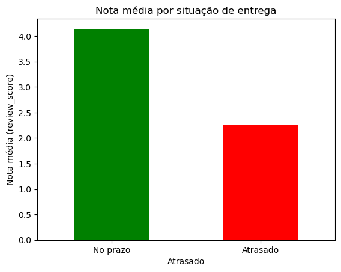
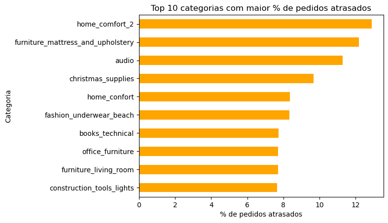
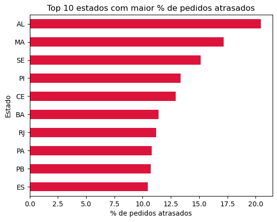

# Análise de E-commerce — Olist Brazilian E-Commerce Dataset

Análise exploratória de dados de e-commerce utilizando o dataset público da Olist, com foco no impacto do prazo de entrega na satisfação do cliente.

## Objetivo

Identificar problemas de negócio relacionados à logística de entrega e propor recomendações baseadas em dados, respondendo três perguntas centrais:

1. O atraso na entrega afeta a satisfação do cliente?
2. Quais categorias de produto têm maior percentual de atraso?
3. Quais estados têm os piores índices de entrega no prazo?

## Sobre o dataset

Dataset público disponibilizado pela Olist no Kaggle, contendo dados reais (anonimizados) de aproximadamente 100 mil pedidos realizados entre 2016 e 2018 em múltiplos marketplaces do Brasil. Inclui informações de pedidos, clientes, produtos, pagamentos, avaliações e vendedores, distribuídas em 9 tabelas relacionais.

Fonte: [Kaggle - Brazilian E-Commerce Public Dataset by Olist](https://www.kaggle.com/datasets/olistbr/brazilian-ecommerce)

## Ferramentas utilizadas

- Python
- Pandas
- Matplotlib
- Jupyter Notebook

## Metodologia

1. Carregamento individual das 9 tabelas do dataset
2. Verificação de estrutura, tipos de dado e valores nulos
3. Unificação das tabelas via merge (pedido → cliente → item → pagamento → review → produto → vendedor)
4. Conversão de colunas de data e criação de métricas de tempo de entrega e atraso
5. Análise de cada pergunta de negócio com agregações e visualizações

## Resultados

### 1. Atraso na entrega x satisfação do cliente

Pedidos entregues no prazo têm nota média de **4.13**, enquanto pedidos atrasados caem para **2.25** — uma queda de cerca de 45%.



### 2. Categorias com maior percentual de atraso

Produtos com logística mais complexa (móveis, colchões, áudio) lideram os atrasos, com até **12.9%** dos pedidos atrasados na categoria `home_comfort_2`.



### 3. Estados com maior percentual de atraso

Estados do Norte e Nordeste concentram os piores índices, com destaque para Alagoas (**20.5%**) e Maranhão (**17.2%**) — mais que o dobro da média nacional.



## Conclusão

O atraso na entrega tem impacto direto e mensurável na satisfação do cliente. O problema não é generalizado: concentra-se em categorias de produtos volumosos/frágeis e em regiões geograficamente mais distantes dos centros de distribuição (Norte/Nordeste).

**Recomendação de negócio:** priorizar investimento logístico nessas regiões e categorias específicas, em vez de medidas genéricas para toda a operação.

## Como executar

```bash
git clone https://github.com/Iury-Benter-Magalhaes/olist-ecommerce-analysis.git
cd olist-ecommerce-analysis
jupyter notebook analise_olist.ipynb
```

## Autor

Iury Benter Magalhães
[LinkedIn](www.linkedin.com/in/iury-benter-) · [GitHub](https://github.com/Iury-Benter-Magalhaes)
